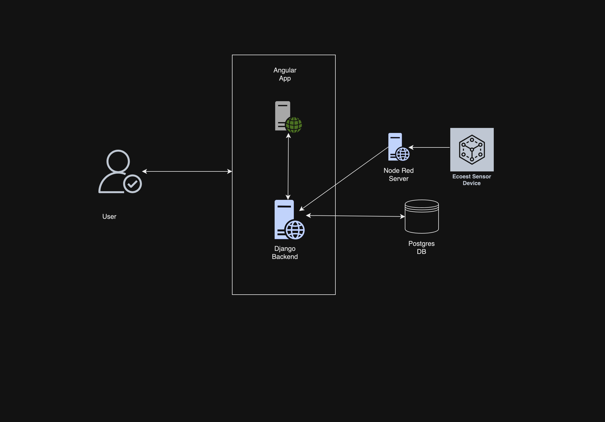
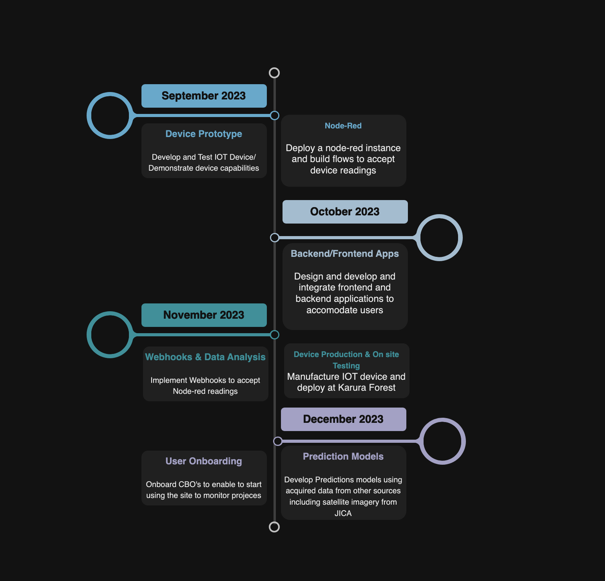

# Team Ecoest

- [Project summary](#project-summary)
  - [The issue we are hoping to solve](#the-issue-we-are-hoping-to-solve)
  - [How our technology solution can help](#how-our-technology-solution-can-help)
  - [Our idea](#our-idea)
- [Technology implementation](#technology-implementation)
  - [IBM AI service(s) used](#ibm-ai-services-used)
  - [Other IBM technology used](#other-ibm-technology-used)
  - [Solution architecture](#solution-architecture)
- [Presentation materials](#presentation-materials)
  - [Solution demo video](#solution-demo-video)
  - [Project development roadmap](#project-development-roadmap)
- [Additional details](#additional-details)
  - [How to run the project](#how-to-run-the-project)
  - [Live demo](#live-demo)


## Project summary

### The issue we are hoping to solve

The Ecoest project is an attempt at employing IOT and AI Technology to boost Forest Bio Diversity Conservation efforts in
Kenya. 
### How our technology solution can help
Our solution enables:
- Real-time data collection and analysis to increase visibility and monitoring of forest conditions
- Helps inform conservation efforts by logging all ongoing reforestation projects.
- Prevent spread of Wild Fires through early detection

### Our idea

Our solution is a Web Based iot powered forest monitoring system. It features Automated Forest Monitoring System enabled by custome IOT, A Comprehensive Dashboard with Real Time Data on
climatic conditions using Node Red and an Automated Fire Monitoring System & Alerts service. 

[//]: # (More detail is available in our [description document]&#40;./docs/DESCRIPTION.md&#41;.)

## Technology implementation

### IBM AI service(s) used

- [IBM MQTT](https://cloud.ibm.com/catalog/services/natural-language-understanding) 
is used in this project to send messages form the device to our node red server. Using the publish/subscribe mechanism we are able to publish sensor readings that can be displayed on the APP
- [Node-RED](https://nodered.org/) Node-Red is used to create an interactive map displaying all identified forest reserves targetd by this project for monitoring.

### Solution architecture

Diagram and step-by-step description of the flow of our solution:



1. User visits Ecoest App through an Angular App client
2. The device takes temperature, humidity and gas readings every 20 minutes
3. MQTT client publishes readings through MQTT Broker to the node-red server. 
4. Node-red publishes the data onto Ecoest Backend for analysis and Storage.
5. Backend responds to client request with received data from node-red server

## Presentation materials

_INSTRUCTIONS: The following deliverables should be officially posted to your My Team > Submissions section of the [Call for Code Global Challenge resources site](https://cfc-prod.skillsnetwork.site/), but you can also include them here for completeness. Replace the examples seen here with your own deliverable links._

### Solution demo video

[](https://youtu.be/vOgCOoy_Bx0)

### Project development roadmap

The project currently does the following things.

- Performs real time monitoring of identified forest reserves using IOT devices 
- Provides visibility on Community Based Reforestation Projects


In the future we plan to...

- Develop a prediction model on deforestation using data sources gathered during the challenge and with the help of open source data by initiatives such as tha JICA REDD+ project.


See below for our proposed schedule on next steps after Call for Code 2023 submission.



## Additional details

### How to run the project
#### Frontend:
  * ```cd eco-frontend```
  * ```npm install```
  * ```npm run start```
#### Backend:
  * ```cd ecoest```
  * ```python -m venv venv```
  * ```source venv/bin/activate```
  * ```pip install -r requirements.txt```
  * ```python manage.py migrate```
  * ```python manage.py runserver```
### Live Demo
### [Node Red Dashboard](http://40.76.113.55:1880/kenya/) 
